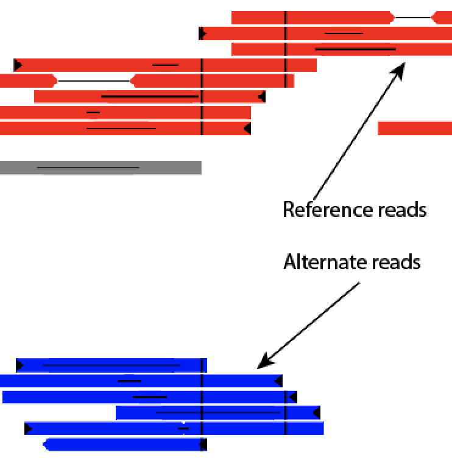
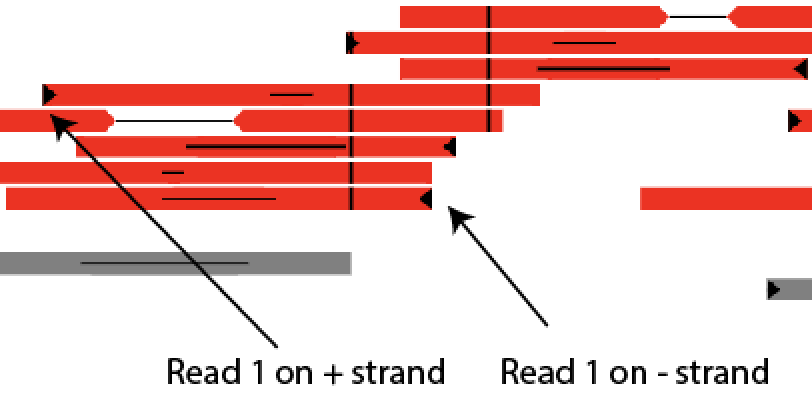

# PhasedPileup
Make a display with reads from a BAM file phased to the correct parent genome
## Example

## Requirements and Usage

This package requires:
* pysam  (tested with 0.12.0.1)
* svgwrite (tested with 1.1.11)

The most common usage is to view the pileup of a particular gene:

    # Phased reads around a specified gene (YFG01 = your favorite gene 1)
    python PhasedPileup.py --gtf-file ANNOTATION.gtf --gene YFG01 snp_file.txt samfile.bam
which will then output `YFG01_samfile_phased.svg` (though there are options to
control this).

But you can also provide any arbitrary genomic region:

    # Phased reads in a genomic region
    python PhasedPileup.py --coords chr1:3600-3800 snp_file.bed samfile.bam
    python PhasedPileup.py --coords chr9:3600..3800 snp_file.bed samfile.bam

The SNP file is assumed to be in the format:

    CHROM	POS0 POS1	REF|ALT

where POS0 is the 0-based coordinate and POS1 is the 1-based coordinate of the
SNP. It is furthermore assumed that there are no indels in the file... I
haven't considered what might happen if they were in there.

## Viewing output images

This code creates figures that are designed to be viewed in a browser.  You can
hover over an individual read to see more data on it (read ID, read coordinate
blocks, etc), or hover over an exon to show the exon boundaries.

You can also use a vector editor like Adobe Illustrator or Inkscape to import
the images and make further edits.

## Colors and visual style

Red reads are the reference allele, and blue reads are the alternate allele.
Gray reads are reads that cannot be unambiguously phased, either due to not
overlapping a SNP, or having SNPs with conflicting or unknown phase.

For reads that have been properly phased, the SNPs that go into that
information will be indicated by a vertical black line at the SNP's coordinate.
However, if a (gray) read overlaps SNPs that make the calling in any way
ambiguous, then they will be colored to show the parent of origin information.
For instance, a read that that, at one location, maps to reference, while at
the other location maps to an alternate should have both a blue and a red line
at the relevant positions. In some cases, if the forward and reverse reads
overlap, it may appear that a properly mapped read is called ambiguous if the
SNP in the forward is towards one parent, while the SNP in the reverse read is
for the other parent. 

It is possible to have a paired-end read where the only phasing information
comes from one of the reads. This is normal, and at present there isn't an
option to turn that behavior off. Give me a holler if you think that's what you
want to do.

Additionally, read1 is marked with a black flag at the start of the read.

Reads that span an intron (or, more generally, with a gap relative to the
reference sequence) are shown with a horizontal line in the phase color that
spans the intron. If you have paired-end reads, the unsequenced portion of the
insert is shown with a black line connecting the tips of the two reads.  If the
forward and reverse read overlap, then the black line will instead indicate the
overlapping portion of the read.

At the moment, these are all hard-coded in, but they can either be edited in
the code or by editing the CSS style information of the produced SVG file.

